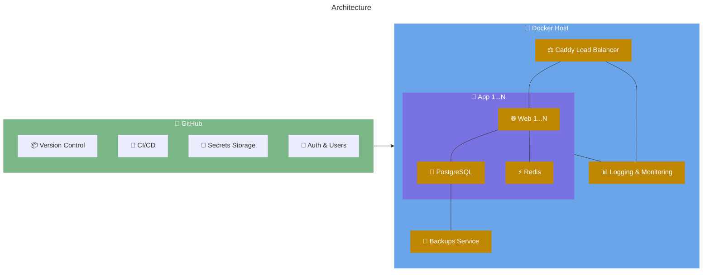

<p align="center">
  <picture>
    <source media="(prefers-color-scheme: dark)" srcset="./images/logo-dark.svg">
    <source media="(prefers-color-scheme: light)" srcset="./images/logo-light.svg">
    
  </picture>
</p>

# The Box — Secure, convenient, fast & free forever!

Production ready services fully managed on a RaspberryPi (or any other machine):

- 🏗️ [12-factor] app principles
- 🚀 continues deployment
- 🔐 environment & key management
- 🗄️ managed databases ([PostgreSQL], [Redis])
- 🔔 managed [updates & security alerts][dependabot]
- 📊 monitoring & [logging][dozzle]
- 🔒 SSL via [Let's Encrypt][letsencrypt]
- 🐍 [Python] & 🟢 [Node.js] support (more languages coming soon)

No config, no costs, just GitHub and your own server.

## Getting Started

```
bash <(curl -fsSL https://raw.githubusercontent.com/codingjoe/the-box/main/bin/install.sh)
```

The installer will guide you through the setup process and get your first application up and running in seconds!

Do connect to your Docker host you use the context:

```bash
docker context import PROJECT_NAME collaborator.dockercontext
docker context use PROJECT_NAME
docker ps
```

### DNS Setup

If you haven't done so already, here are the steps to set up your DNS records:

```text
A @ YOUR_SERVER_IP
A * YOUR_SERVER_IP
AAAA @ YOUR_SERVER_IPV6
AAAA * YOUR_SERVER_IPV6
```

## How it works



The Box uses a GitOps approach to deploy and manage your applications. GitHub is used as the single source of truth for application code, configuration, and secrets and authentication for staff.
The [Docker] host runs the applications in lightweight containers, managed by Docker Compose. A [Caddy] load balancer handles incoming traffic, providing automatic HTTPS and routing requests to the appropriate web servers. Each application has its own PostgreSQL database and Redis instance for caching.

[12-factor]: https://12factor.net/
[caddy]: https://caddyserver.com/
[dependabot]: https://github.com/dependabot
[docker]: https://www.docker.com/
[dozzle]: https://dozzle.dev/
[letsencrypt]: https://letsencrypt.org/
[node.js]: https://nodejs.org/
[postgresql]: https://www.postgresql.org/
[python]: https://www.python.org/
[redis]: https://redis.io/
